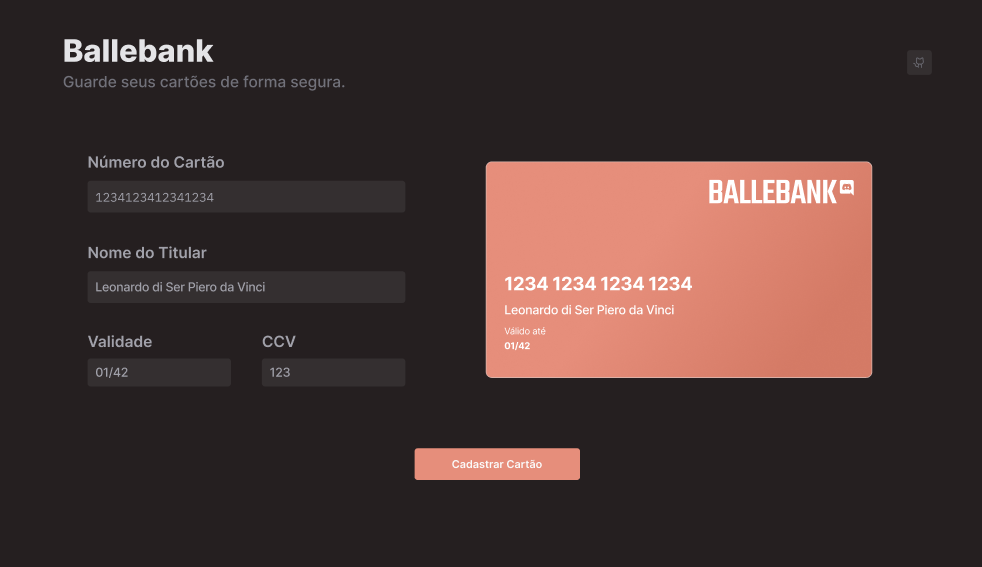
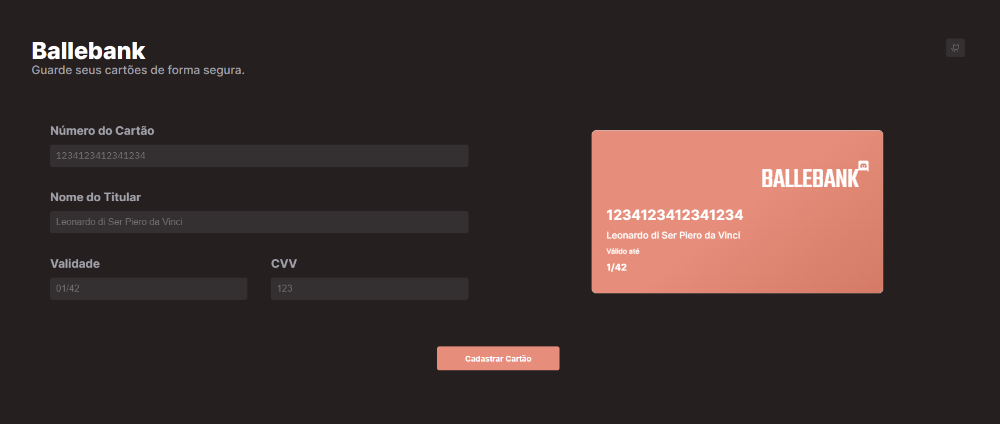

<h1 align="center"> Ballebank | Em Construção 🚧</h1>

Projeto de frontend para armazenar informações de um cartão de credito. Realizado através dos desafios da comunidade da Rafaela Ballerini no  <a href="https://discord.com/channels/789888698673922078/789901664634798131">Discord  

  <a href="#-tecnologias">Tecnologias</a>&nbsp;&nbsp;&nbsp;|&nbsp;&nbsp;&nbsp;
  <a href="#-projeto">Projeto</a>&nbsp;&nbsp;&nbsp;|&nbsp;&nbsp;&nbsp;
  <a href="#-layout">Comentários</a>&nbsp;&nbsp;&nbsp;&nbsp;&nbsp;&nbsp;

 
<h2 align="center">Proposto:</h2>

  

<h2 align="center">Realizado:</h2>

  

## 🚀 Tecnologias

Esse projeto foi desenvolvido com as seguintes tecnologias:

- HTML e CSS
- JavaScript
- Git e Github

## 💻 Projeto

Frontend de um sistema para armazenar dados de um cartão de crédito.

<s>- [Visite o projeto online]()</s>

## :book: Comentários
Apesar de ainda nao estar completo, codigo do projeto esta me incomodando, acredito que esta com muitas repetições e precisa de refatoramento. Precisei pesquisar coisas novas, então o desafio se torna interessante por esses aspectos.

Feito por Diego Web3r
